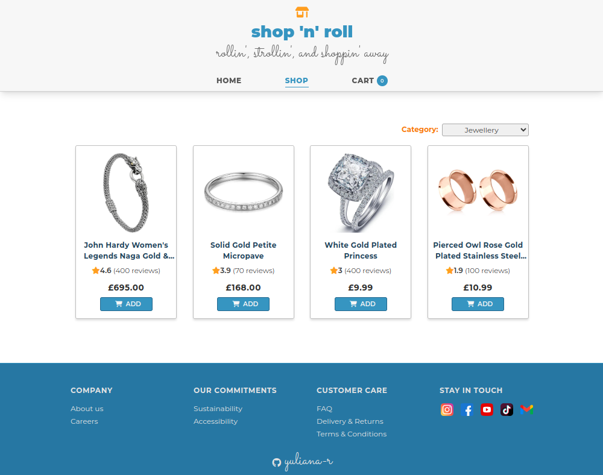
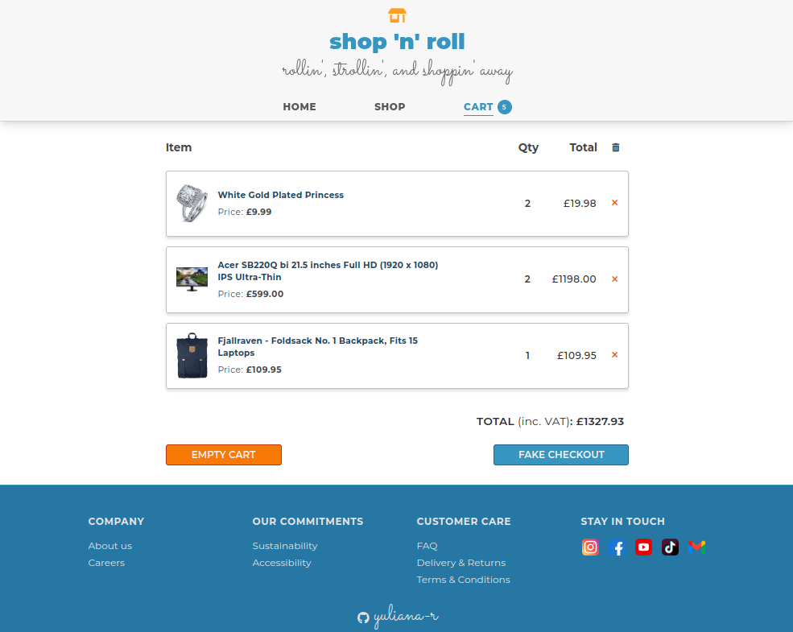

# Shopping Cart App
## Introduction 

This project is a mock front-end interface for an online store with ability to browse, add and remove items from the shopping cart. 

This project primarily demonstrates use of React client-side routing, useContext and useMemo hooks, React data fetching from [Fake Store API](https://fakestoreapi.com/) and Tailwind CSS.

## Preview

## Media & assets credits:

1. Flaticon (kmg design): https://www.flaticon.com/free-icons/shopping

2. Flaticon (Pixel perfect): https://www.flaticon.com/free-icons/instagram-logo

3. Flaticon (Pixel perfect): https://www.flaticon.com/free-icons/facebook

4. Flaticon (Rakib Hassan Rahim): https://www.flaticon.com/free-icons/youtube

5. Flaticon (Freepik): https://www.flaticon.com/free-icons/gmail

6. Flaticon (Ruslan Babkin): https://www.flaticon.com/free-icons/tiktok

7. Unsplash (Kara Eads): https://unsplash.com/photos/buhmhprfo3g

8. Unsplash (Becca Tapert): https://unsplash.com/photos/mDOGXiuVb4M

  